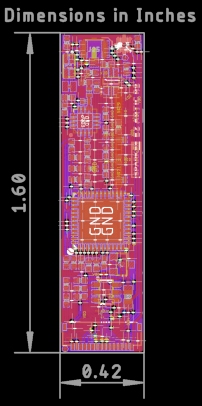

# SparkX smôl ARTIC R2

[*SparkX smôl ARTIC R2 (SPX-18618)*](https://www.sparkfun.com/products/18618)

The ARGOS ARTIC R2 satellite communication chipset in smôl format.

## Repository Contents

- [**/Hardware**](./Hardware) - Eagle PCB, SCH and LBR design files
- [**LICENSE.md**](./LICENSE.md) - contains the licence information

## Product Versions

- [SPX-18618](https://www.sparkfun.com/products/18618) - Original SparkX Release.

## Thanks

The ARTIC R2 circuit is a remix of the reference design kindly provided by the [Arribada Initiative](https://arribada.org/) and Icoteq Ltd.

## License Information

This product is _**open source**_!

Please review the LICENSE.md file for license information.

If you have any questions or concerns on licensing, please contact technical support on our [SparkFun forums](https://forum.sparkfun.com/viewforum.php?f=123).

Distributed as-is; no warranty is given.

- Your friends at SparkFun.
