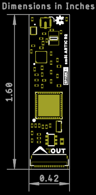

# SparkX smôl ARTIC R2

[*SparkX smôl ARTIC R2 (SPX-18618)*](https://www.sparkfun.com/products/18618)

The ARGOS ARTIC R2 satellite communication chipset in smôl format.

The ARTIC-R2 is an integrated low power small size ARGOS 2/3/4 single chip radio. ARTIC-R2 implements a message based wireless interface. For satellite uplink communication, ARTIC-R2 will encode, modulate and transmit provided user messages. For downlink communication, ARTIC-R2 will lock to the downstream, demodulate and decode it and extract the satellite messages.

The ARTIC-R2 can transmit signals in frequency bands around 400MHz and receive signals in the bands around 466MHz, in accordance with the ARGOS satellite system specifications. The ARTIC-R2 is compliant to all ARGOS 3 and ARGOS 4 RX and TX standards. It contains a RF transceiver and frequency synthesizer and a digital baseband modem. The ARTIC-R2 contains an on-chip power amplifier delivering 1mW [0dBm] output power, that serves as an output for connecting an external high efficient PA. The (de)modulation algorithms run on an on-chip DSP. This software approach allows for retargeting the ARTIC for other applications. The DSP program can be retained on an external flash or the MCU.

- Serial interface (SPI) for communication with MCU
- Programmable DSP core on board to ensure flexibility
- RX frequency : 466MHz – TX frequency: 400MHz
- Fractional N frequency synthesis
- Supported TX standards:
  - BPSK: PTT-A2 (ARGOS 2), PTT-VLD (ARGOS 4)
  - QPSK: PTT-A3, PTT-ZE (ARGOS 3)
  - GMSK: PTT-HD (ARGOS 3), PTT-MD (ARGOS 4), PTT-HD (ARGOS 4)
- Supported RX standards:
  - BPSK: PMT-A3 (ARGOS 3)
  - DSSS OQPSK: PMT-A4 (ARGOS 4) not available
- Dedicated flash Interface to retain Firmware
- Support COSPAS-SARSAT standard
- Operates on external 26MHz reference clock
- Dual supply, 1.8V and 3.3V
- Integrated PA (0dBm) to combine with external PA

An RFPA0133 programmable gain power amplifier boosts the 0dBm (1mW) output from the ARTIC by up to 26dB, producing a maximum transmit power level of 400mW. The transmit power can be adjusted via the Arduino Library.

The ARGOS satellite system is restricted to specific programs and applications. Please check that your project meets these requirements before buying hardware. [CLS (France)](https://www.cls-telemetry.com/argos-solutions/) and the [Woods Hole Group (America)](https://www.clsamerica.com/science-with-argos) will be able to advise if your project meets the requirements.
- _**"To meet system use requirements, all programs using Argos have to be related in some way or other to environmental protection, awareness or study, or to protecting human life."**_

## Repository Contents

- [**/Hardware**](./Hardware) - Eagle PCB, SCH and LBR design files
- [**LICENSE.md**](./LICENSE.md) - contains the licence information

## Connections

### IN Connector (Bottom Layer)

**Starting Left Edge, going Right:**

| Pin | Name | Description |
|---|---|---|---|
| **1** | **PROC_PWR_EN** | Not used by the smôl ARTIC R2. It is used to disable the power regulator on smôl processor boards. |
| **2** | **3.3V** | 3.3V power supply for the module. **Voltage must be: 3.3V +/- 0.1V**. Current limit: 500mA. |
| **3** | **GND** | Power ground / 0V. |
| **4** | **SCLK** | SPI interface clock signal. Typically 1MHz. 3.3V. See the ARTIC R2 datasheet for the permitted clock speeds. |
| **5** | **COPI** | SPI interface: Controller Out Peripheral In. 3.3V. |
| **6** | **CIPO** | SPI interface: Controller In Peripheral Out. 3.3V. |
| **7** | **CS0** | SPI chip select for the ARTIC R2. |
| **8** | **CS1** | SPI chip select. Not used by the smôl ARTIC R2. Routed to the OUT CS0 pin. |
| **9** | **CS2** | SPI chip select. Not used by the smôl ARTIC R2. Routed to the OUT CS1 pin. |
| **10** | **GPIO0** | Power Enable for the ARTIC R2. Pulled low via a 10k resistor. Pull up to 3.3V to enable power for the ARTIC R2. |
| **11** | **GPIO1** | GPIO. Not used by the smôl ARTIC R2. Routed to the OUT GPIO0 pin. |
| **12** | **SDA** | I2C data signal. Used to communicate with the smôl ARTIC R2 PCA9536 GPIO expander; providing access to the RESETB, INT1, BOOT and G8 signals. |
| **13** | **SCL** | I2C clock signal. Used to communicate with the smôl ARTIC R2 PCA9536 GPIO expander; providing access to the RESETB, INT1, BOOT and G8 signals. |
| **14** | **GND** | Power ground / 0V. |
| **15** | **3.3V** | 3.3V power supply for the module. **Voltage must be: 3.3V +/- 0.1V**. Current limit: 500mA. |
| **16** | **V_USB** | Not used by the smôl ARTIC R2. It is used to pass USB power from a smôl processor board to a power board. |

### OUT Connector (Top Layer)

**Starting Right Edge, going Left:**

| Pin | Name | Description |
|---|---|---|---|
| **1** | **PROC_PWR_EN** | Not used by the smôl ARTIC R2. It is used to disable the power regulator on smôl processor boards. |
| **2** | **3.3V** | 3.3V power supply for the module. **Voltage must be: 3.3V +/- 0.1V**. Current limit: 500mA. |
| **3** | **GND** | Power ground / 0V. |
| **4** | **SCLK** | SPI interface clock signal. Typically 1MHz. 3.3V. See the ARTIC R2 datasheet for the permitted clock speeds. |
| **5** | **COPI** | SPI interface: Controller Out Peripheral In. 3.3V. |
| **6** | **CIPO** | SPI interface: Controller In Peripheral Out. 3.3V. |
| **7** | **CS1** | SPI chip select - connected to the IN connector CS1 pin. This becomes CS0 when connected to the IN connector on the smôl board above this one. |
| **8** | **CS2** | SPI chip select - connected to the IN connector CS2 pin. This becomes CS1 when connected to the IN connector on the smôl board above this one. |
| **9** | **N/C** | |
| **10** | **GPIO1** | GPIO - connected to the IN connector GPIO1 pin. This becomes GPIO0 when connected to the IN connector on the smôl board above this one. |
| **11** | **N/C** | |
| **12** | **SDA** | I2C data signal. Used to communicate with the smôl ARTIC R2 PCA9536 GPIO expander; providing access to the RESETB, INT1, BOOT and G8 signals. |
| **13** | **SCL** | I2C clock signal. Used to communicate with the smôl ARTIC R2 PCA9536 GPIO expander; providing access to the RESETB, INT1, BOOT and G8 signals. |
| **14** | **GND** | Power ground / 0V. |
| **15** | **3.3V** | 3.3V power supply for the module. **Voltage must be: 3.3V +/- 0.1V**. Current limit: 500mA. |
| **16** | **V_USB** | Not used by the smôl ARTIC R2. It is used to pass USB power from a smôl processor board to a power board. |

## Antenna

The antenna is connected via a uFL connector. A 400MHz quarter wave wire antenna is all that is required for most applications.

**Always ensure an antenna is attached to the smôl ARTIC R2. (Never attempt to transmit without an antenna attached! Doing so can damage the RF amplifier.)**

## Arduino Library

The [SparkFun ARGOS ARTIC R2 Arduino Library](https://github.com/sparkfun/SparkFun_ARGOS_ARTIC_R2_Arduino_Library) contains a set of [examples](https://github.com/sparkfun/SparkFun_ARGOS_ARTIC_R2_Arduino_Library/tree/main/examples/smol_ARTIC_R2) to get you up and running with the smôl ARTIC R2.

## Product Versions

- [SPX-18618](https://www.sparkfun.com/products/18618) - Original SparkX Release.

## Thanks

The ARTIC R2 module is a remix of the reference design kindly provided by the [Arribada Initiative](https://arribada.org/) and Icoteq Ltd.

## License Information

This product is _**open source**_!

Please review the LICENSE.md file for license information.

If you have any questions or concerns on licensing, please contact technical support on our [SparkFun forums](https://forum.sparkfun.com/viewforum.php?f=123).

Distributed as-is; no warranty is given.

- Your friends at SparkFun.
