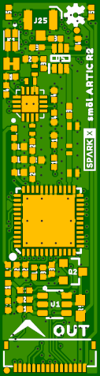

# SparkX smôl ARTIC R2

[*SparkX smôl ARTIC R2 (SPX-18363)*](https://www.sparkfun.com/products/18363)

The ARGOS ARTIC R2 satellite communication chipset in smôl format.

## Repository Contents

- **/Documentation** - Datasheets etc.
- **/Hardware** - Eagle design files
- **LICENSE.md** contains the licence information

## Examples

Example sketches for the smôl ARTIC R2 can be found in the [SparkFun ARGOS ARTIC R2 Arduino Library](https://github.com/sparkfun/SparkFun_ARGOS_ARTIC_R2_Arduino_Library/tree/main/examples/smol_ARTIC_R2)

## Product Versions

- [SPX-18363](https://www.sparkfun.com/products/18363) - Original SparkX Release.

## License Information

This product is _**open source**_!

Please review the LICENSE.md file for license information.

If you have any questions or concerns on licensing, please contact technical support on our [SparkFun forums](https://forum.sparkfun.com/viewforum.php?f=123).

Distributed as-is; no warranty is given.

- Your friends at SparkFun.
